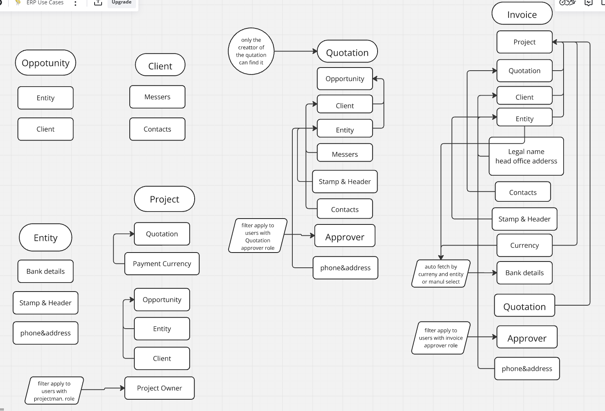

# Cycle Of Opportunity -> Quotation -> Project -> Invoice

before start test ( Client - Entity - Entity Bank Account - Employee ) Must have Accurate data

Client : Client Legal Name - Headquarters Address - Contacts  
Entity : Stamp - Header - Phone Number - Address - VAT Percentage - Withholding Tax Percentage  
Entity Bank Account : Must have a Default bank account For every entity (Will be used to find the currency)  
Employee : Must have Employees with cost Per day not = 0

