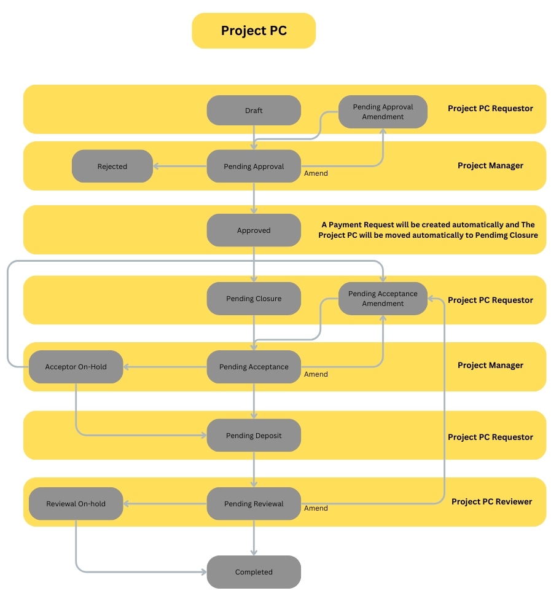

# Doctype: Project PC 
## **Fields:**
https://docs.google.com/spreadsheets/d/1pM00cEx-GW7PGRssap46XCUBQy66IxYRPd6ozJhntYc/edit?usp=sharing
## **Validations:**

## **Workflow:**

## **Permissions:**
Read: R
Write: W
Create: C
Delete: D

|                      | Level 0 | Level 1 |
| -------------------- | ------- | ------- |
| Project PC Requestor | R/W/C/D | R/W     |
| Project Manager      | R/W     | R       |
| Project PC Reviewer  | R/W     | R       |
| Finance              | R       | R       |
| Frappe Lord          | R/W/C/D | R/W     |
| System Manager       | R/W/C/D | -       |
## View Filters

Project PC Requestor/ Urgent Project PC Requestor : Can see only the requests he created
Project Manager : Can see only the requests linked to his projects

## Special Scripts:  

When Project PC is Approved A Payment Request will be created automatically and The Project PC will be moved automatically to Pending Closure
## Child tables:

### Petty Cash Descriptions

![[Petty Cash Descriptions]]