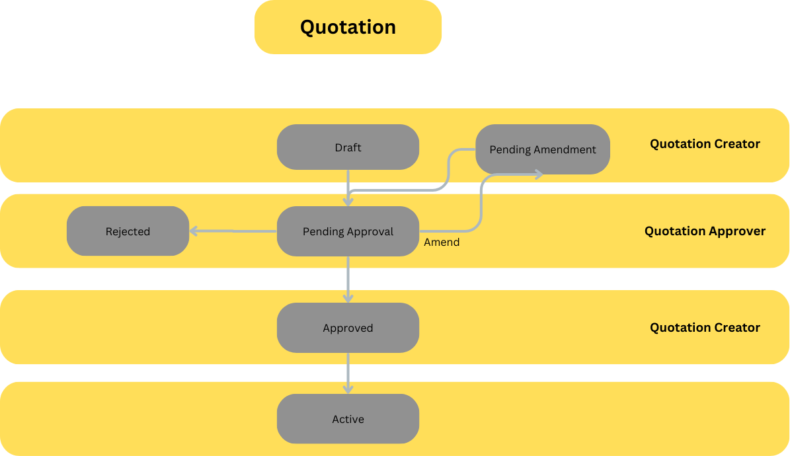

# Doctype: Quotation
## **Fields:**
https://docs.google.com/spreadsheets/d/154WG4gBfgombMvTukuCkQX2-_cDdue5LbgJ2CL3dwSs/edit?usp=sharing
## **Validations:**

## **Workflow:**



## **Permissions:**
Read: R
Write: W
Create: C
Delete: D

|                    | Level 0 | Level 1 | Level 2 | Level 3 |
| ------------------ | ------- | ------- | ------- | ------- |
| Quotation Creator  | R/W/C/D | R/W     | R/W     | -       |
| Quotation Approver | R/W     | R       | R       | R       |
| Operations Officer | R/W     | R       | R/W     | -       |
| Finance Manager    | R       | R       | R       | R       |
| Sales Manager      | R       | R       | R       | R       |
| System Manager     | R/W/C/D | -       | -       | -       |
## View Filters:

## Special Scripts:  

- When Apply VAT Checkbox in breakdown tab checked a code will calculate the VAT automatically
## Child tables:

### Contacts
![[Contacts]]

### Expanse Breakdowns

![[Expense Breakdowns]]

### Payment Terms

![[Quotation Payment Term]]

## Print Format

```html
<!DOCTYPE html>
<html lang="en">

<head>
    <meta charset="UTF-8">
    <meta name="viewport" content="width=device-width, initial-scale=1.0">
    <title>Quotation</title>
    <link href="https://fonts.cdnfonts.com/css/script-mt" rel="stylesheet">
</head>

<body>
    
    <!-- First Page -->
    <div class="border-container">
        <div class="container">

            <div class="header">
                
            </div>

            <hr>

            <div class="row">
                <div class="right-col">
                    <div id="messers-label"><label for="messers">Messers</label></div>
                    <div class="right-col-content">
                        <div class="messers-container">
                            <span class="client">{{doc.client_legal_name}}</span>
                            <span class="messers">{{doc.client_address}}</span>
                        </div>
                        <span>Att. Of</span> <input type="text" id="attn" style="width: 65%;" value="{{doc.contacts[0].full_name}}" readonly><br>
                        <span>Email</span> <input type="email" id="email" value="{{doc.contacts[0].email}}"
                            style="width: 84%;" readonly>
                        <span>Phone</span> <input type="tel" id="phone" value="+ {{doc.contacts[0].mobile_number}}"
                            style="width: 39.5%;" readonly> & <input type="tel" id="sec_phone" value="+"
                            style="width: 40%;" readonly><br>
                    </div>
                </div>

                <div class="left-col">
                    <div class="quotation-title"><label>QUOTATION</label></div>
                    <div class="left-col-content">
                        <span>Number</span> <input type="text" id="number" value="{{doc.quotation_number}}"
                            style="width: 35%;" readonly><br>
                        <span>Date</span><input type="text" id="day" style="width: 10%;" readonly><input type="text"
                            id="month" style="width: 10%;" readonly><input type="text" id="year" style="width: 15%;"
                            readonly><br>
                        <span>Currency</span> <input type="text" id="currency" value="{{doc.currency}}"
                            style="width: 20%;" readonly><br>
                        <span>Project</span><input type="text" id="project" value="{{doc.project}}" style="width: 97%;"
                            readonly>
                        <span>Your Ref</span> <input type="text" id="ref" style="width: 79%;"  value="{{doc.customer_reference}}" readonly>
                    </div>
                </div>
            </div>

            <table>
                <thead>
                    <tr>
                        <th class="item-column">Item</th>
                        <th class="des-column">Description</th>
                        <th class="qty-column">Qty.</th>
                        <th class="price-column">Unit Price <br> <span class="custom_font">{{doc.currency}}</span></th>
                        <th class="total-column">Total <br> <span class="custom_font">{{doc.currency}}</span></th>
                    </tr>
                </thead>
                <tbody id="table-body">
                    
                    <tr>
                            <td class="item">
                            </td>
                            
                            <td class="item">{{ expense.item }}</td>
                            
                            <td class="description">{{ expense.description }}</td>
                            
                            
                            <td class="item_bold"></td>
                            
                            <td class="item_bold">{{ expense.item }}</td>
                            
                            <td class="description_bold">{{ expense.description }}</td>
                            
                            <td>{{ expense.quantity }}</td>
                            <td>{{ "{:0,.2f}".format(expense.unit_price) }}</td>
                            <td>{{ "{:0,.2f}".format(expense.total) }}</td>
                            
                            <td></td>
                            <td></td>
                            <td></td>
                            <td></td>
                            <td></td>
                            
                    </tr>
                    
                </tbody>
                
                <tfoot>
                    <tr>
                        <td colspan="4" class="no-borders">
                            <div style="display: flex; justify-content: flex-end;">
                                <div style="color: #1F4E78">Sub-Total</div>
                            </div>
                            <div style="display: flex; justify-content: space-between;">
                                <div class="only"><span style="color: #1F4E78">{{ doc.total_in_words }}</span></div>
                                
                                <div style="color: #1F4E78">VAT @ {{ doc.vat_percentage }}%</div>
                                
                                <div style="color: #1F4E78">VAT @ 0%</div>
                                
                            </div>
                        </td>
                        <td>
                            <div style="display: flex; justify-content: center;">{{ "{:0,.2f}".format(doc.total) }}
                            </div>
                            
                            <div style="display: flex; justify-content: center;">{{ "{:0,.2f}".format(doc.vat_amount) }}
                            </div>
                            
                            <div style="display: flex; justify-content: center;">0.00</div>
                            
                        </td>
                    </tr>
                    <tr>
                        <td colspan="4" class="no-borders">
                            <div style="display: flex; justify-content: flex-end; font-weight: bold;">
                                <div style="color: #1F4E78">Total Including VAT</div>
                            </div>
                        </td>
                        <td>
                            
                            <div style="display: flex; justify-content: center;">{{ "{:0,.2f}".format(doc.total +
                                doc.vat_amount) }}</div>
                            
                            <div style="display: flex; justify-content: center;">{{ "{:0,.2f}".format(doc.total) }}
                            </div>
                            
                        </td>
                    </tr>
                </tfoot>
                
            </table>
            
            <div class="footer-signature">
                
                <div class="authorised">
                    <p>Authorised Signature</p>
                    
                </div>
                <div class="signature">
                    
                </div>
                
            </div>
            
            <div class="footer-signature" style="margin-top: 35px;">
                
                <div class="authorised">
                    <p>Authorised Signature</p>
                    
                </div>
                <div class="signature">
                    
                </div>
                
            </div>
            

            <footer class="footer">
                <hr class="footer-line">
                <div class="footer-data">
                    <p>{{ doc.address }}</p>
                    <p>
                        <span>info@gamersloungeme.com</span>
                        <span>www.gamersloungeme.com</span>
                    </p>
                    <p>Phone: {{ doc.phone }}</p>
                </div>
            </footer>
        </div>
    </div>
    
    
    
    <!-- Extra Expense Pages -->

    
    
    

    
        <div class="remaining-expenses page-break border-container container">
            <div class="header">
                
            </div>
            
            <table>
                <thead>
                    <tr>
                        <th class="item-column">Item</th>
                        <th class="des-column">Description</th>
                        <th class="qty-column">Qty.</th>
                        <th class="price-column">Unit Price <br> <span class="custom_font">{{doc.currency}}</span></th>
                        <th class="total-column">Total <br> <span class="custom_font">{{doc.currency}}</span></th>
                    </tr>
                </thead>
                <tbody id="table-body">
                    
                        
                            
                            <tr>
                                <td class="item_bolditem">
                                    {{ expense.item or '' }}
                                </td>
                                <td class="description_bolddescription">
                                    {{ expense.description }}
                                </td>
                                <td>{{ expense.quantity }}</td>
                                <td>{{ "{:0,.2f}".format(expense.unit_price) }}</td>
                                <td>{{ "{:0,.2f}".format(expense.total) }}</td>
                            </tr>
                        
                            <tr>
                                 
                                <td></td>
                                
                            </tr>
                        
                    
                </tbody>
                
                <tfoot>
                    <tr>
                        <td colspan="4" class="no-borders">
                            <div style="display: flex; justify-content: flex-end;">
                                <div style="color: #1F4E78">Sub-Total</div>
                            </div>
                            <div style="display: flex; justify-content: space-between;">
                                <div class="only"><span style="color: #1F4E78">{{ doc.total_in_words }}</span></div>
                                
                                <div style="color: #1F4E78">VAT @ {{ doc.vat_percentage }}%</div>
                                
                                <div style="color: #1F4E78">VAT @ 0%</div>
                                
                            </div>
                        </td>
                        <td>
                            <div style="display: flex; justify-content: center;">{{ "{:0,.2f}".format(doc.total) }}
                            </div>
                            
                            <div style="display: flex; justify-content: center;">{{ "{:0,.2f}".format(doc.vat_amount) }}
                            </div>
                            
                            <div style="display: flex; justify-content: center;">0.00</div>
                            
                        </td>
                    </tr>
                    <tr>
                        <td colspan="4" class="no-borders">
                            <div style="display: flex; justify-content: flex-end; font-weight: bold;">
                                <div style="color: #1F4E78">Total Including VAT</div>
                            </div>
                        </td>
                        <td>
                            
                            <div style="display: flex; justify-content: center;">{{ "{:0,.2f}".format(doc.total +
                                doc.vat_amount) }}</div>
                            
                            <div style="display: flex; justify-content: center;">{{ "{:0,.2f}".format(doc.total) }}
                            </div>
                            
                        </td>
                    </tr>
                </tfoot>
                
            </table>
            <div class="footer-signature" style="margin-top: 35px;">
                
                <div class="authorised">
                    <p>Authorised Signature</p>
                    
                </div>
                <div class="signature">
                    
                </div>
                
            </div>
        </div>
    

            
            
        <!-- Third Page -->

    <div class="border-container">
        <div class="second-container">

            <div class="header">
                
            </div>

            <hr>

            <h4>General Terms & Conditions:</h4>

            <div class="page-content">
                <h5>Contract / Purchase Order</h5>
                <div class="contract"><span>{{ doc.contract_purchase_order }}</span></div>
                <h5>Delivery</h5>
                <div class="delivery"><span>{{ doc.delivery_details }}</span></div>
                <h5>Additional Work / Services</h5>
                <div class="additional"><span>
                        {{ doc.additional_work_services }}
                    </span></div>
                <h5>Payment Terms</h5>
                <div class="payment-terms">
                    <table>
                        <thead>
                            <tr>
                                <th>Payment Schedule</th>
                                <th>Percentage</th>
                                <th>Amount</th>
                            </tr>
                        </thead>
                        <tbody id="table-body">
                            
                            <tr>
                                  <td>{{
                                    term.payment_schedule }}</td>
                                    <td>{{ term.percentage_of_total }} %</td>
                                    <td>{{ "{:0,.2f}".format(term.installment_amount) }}</td>
                                    
                                    <td></td>
                                    <td></td>
                                    
                            </tr>
                            
                        </tbody>
                    </table>
                </div>
                <h5>Offer Validity</h5>
                <div class="validity">
                    <span>This Offer is Valid Until ({{ doc.offer_validity }})</span>
                </div>
                <h5>Disclosure</h5>
                <div class="disclosure">
                    <span>{{doc.disclosure}}</span>
                </div>
                <h5>Other</h5>
                <div class="other">
                    <span>{{doc.other}}</span>
                </div>
            </div>

            <p class="thanks">Thank You for Trusting Our Quality and Looking Forward to Hear from You Soon.</p>

            <div class="footer-signature">
                
                <div class="authorised">
                    <p>Authorised Signature</p>
                    
                </div>
                <div class="signature">
                    
                </div>
                
            </div>

        </div>
    </div>

</body>

</html>

<script>
    document.addEventListener("DOMContentLoaded", function () {
        // Replace with the actual date from your data
        const issueDate = "{{doc.issue_date}}";
        const [year, month, day] = issueDate.split("-");

        // Set the values in the respective fields
        document.getElementById('day').value = day;
        document.getElementById('month').value = month;
        document.getElementById('year').value = year;

        formatted_total = {{ doc.total }}.toLocaleString("en-US");
    });
</script>
```


```css
@import url("https://fonts.cdnfonts.com/css/script-mt");

body {
    margin: 0;
    padding: 0;
}

p {
    margin: 0;
}

.border-container {
    border: 1px solid #000;
    height: 1030px;
}

.container,
.second-container {
    width: 100%;
    margin: 0 auto;
    padding: 20px;
}

.messers-container {
    height: 70px;
    display: flex;
    flex-direction: column;
    width: 98%;
    white-space: pre-line;
    background-color: white;
    border: 1px #000 solid;
    margin-bottom: 5px;

}

.client {
    font-weight: bold;
    font-family: Tahoma, serif;
    color: #000;
    padding: 1px;
}

.messers {
    font-weight: normal;
    font-family: Tahoma, serif;
    color: #000;
    padding: 1px;
}

input,
textarea {
    background-color: white;
    border: 1px solid #000;
    outline: none;
    font-family: Tahoma, serif;
}

.header,
.footer {
    text-align: center;
    margin-bottom: 20px;
}

hr {
    font-weight: bold;
    margin-top: -15px;
    margin-bottom: 15px;
}

.row {
    display: flex;
    justify-content: space-between;
    margin-bottom: 5px;
    border: 1px #000 solid;
    padding: 1px 1px;
    font-family: "Script MT Bold", serif;
    margin-right: 0;
    margin-left: 0;
    /*background-color: #DDEBF7;*/
}

.row-header {
    display: flex;
    flex-direction: row;
}

span {
    color: #1F4E78;
    font-weight: bold;
}

.right-col {
    flex: 1;
}

.left-col {
    flex: 1;
    background-color: #F2F2F2;
}

.right-col-content {
    padding: 5px;
}

.left-col-content {
    padding: 5px;
}

.quotation-title {
    font-size: 23px;
    background-color: white;
    font-family: "Engravers MT", serif;
}

.quotation-title label {
    margin-left: 100px;
    font-weight: bold;
    color: #4472C4 !important;
}

.print-format p {
    margin: 0 !important;
}

.print-format label {
    font-size: 23px;
}

.projects-section {
    margin-top: 20px;
}

#attn {
    margin-left: 6px;
}

#messers {
    font-weight: bold;
}

#email {
    margin-left: 11px;
}

#day {
    margin-left: 25px;
}

#number {
    margin-left: 6px;
}

#status {
    margin-left: 2.5px;
}

#phone {
    margin-left: 9px;
    text-align: left;
    margin-bottom: 5px;
}

#fax {
    margin-left: 19px;
}

#date_text {
    margin-left: 6px;
}

#status_text {
    margin-left: 3px;
}

#currency {
    margin-left: 1px;
}

#project_text {
    margin-left: 39px;
}

#your_ref_text {
    margin-left: 25px;
}

#our_ref_text {
    margin-left: 30px;
}

#payment {
    margin-left: 45px;
}

#ref {
    margin-left: 4px;
}

#number,
#day,
#month,
#year,
#currency,
#project,
#messers,
#attn,
#email,
#payment,
#your_ref,
#status {
    margin-bottom: 5px;
    text-align: center;
}

#number,
#project,
#messers,
#attn,
#email,
#payment,
#your_ref {
    margin-bottom: 5px;
    text-align: left;
}

#messers-label {
    color: #1F4E78 !important;
    background-color: white;
}

#messers-label label {
    color: #1F4E78 !important;
    margin-left: 5px;
}

.col-full {
    width: 100%;
}

table {
    width: 100%;
    table-layout: fixed;
}

table,
th,
td {
    border: 1px solid #000;
}

.print-format th {
    color: #1F4E78;
    font-weight: bold;
    font-family: 'Script MT Bold', serif;
}

.print-format td,
.print-format th {
    padding: 3px !important;
}

th,
td {
    padding: 15px;
    text-align: center;
    font-family: Tahoma, serif;
}

.custom_font {
    font-family: Tahoma, serif;
    font-weight: 100;
}

th.qty-column,
td.qty-column {
    width: 7%;
}

th.price-column,
td.price-column {
    width: 12%;
}

th.des-column,
td.des-column {
    width: 55%;
}

th.total-column,
td.total-column {
    width: 17%;
}

th.item-column,
td.item-column {
    transform: rotate(-90deg);
    width: 4%;
    font-size: 0.7rem;
}

.details,
.bank_name,
.beneficiary,
.iban,
.swift,
.bank_address {
    font-size: smaller !important;
    font-weight: bold !important;
    text-align: left !important;
}

.footer-signature {
    text-align: left;
    display: flex;
    flex-direction: row;
}

.footer-signature p {
    color: #1F4E78;
    font-family: 'Script MT Bold', cursive;
    font-weight: bold;
}

.authorised {
    margin-left: 70px;
}

.authorised img {
    width: 35%;
}

.signature {
    display: inline-block;
    margin-left: 55px;
}

.footer {
    position: fixed;
    bottom: 10px;
    text-align: center;
    width: 100%;
}

.footer-line {
    width: 90%;
    color: blue;
    font-size: bold;
    margin-top: 0;
    margin-bottom: 10px;
    margin-left: 15px;
    border-top: 2px solid #1F4E78;
}

.footer-data {
    display: flex;
    flex-direction: row;
    align-items: center;
}

.footer-data p {
    flex: 1;
    font-size: 14px;
    font-family: Tahoma, serif;
    padding: 0 15px;
    text-align: left;
}

.footer-data p span {
    color: #000;
    font-weight: normal;
}

tbody tr:nth-child(even) {
    background-color: #D6DCE4;
}

tbody tr:nth-child(odd) {
    background-color: white;
}

tfoot td {
    text-align: right;
    font-weight: bold;
}

#table-body td {
    height: 23px;
    vertical-align: middle;
}

.only {
    flex: 2;
    text-align: left;
    background-color: #D6DCE4;
}

.logo {
    width: 6%;
    margin-top: -10px;
}

.description,
.item {
    overflow-wrap: break-word;
    white-space: normal;
}

.description {
    text-align: left;
}

.description_bold,
.item_bold {
    text-align: center;
    font-weight: bold;
}

.second-container h4 {
    text-decoration: underline;
}

.second-container h5 {
    font-weight: bold;
    margin-left: -5px;
}

.page-content {
    padding: 3px 15px;
}

.page-content div span {
    color: black;
}

.print-format td,
.print-format th {
    vertical-align: middle !important;
}

.no-borders {
    border-color: transparent;
    border-right-style: dashed;
}

.contract,
.additional,
.payment-terms,
.validity,
.disclosure,
.other {
    height: fit-content;
    width: 100%;
    padding: 0 5px;
    margin-top: -10px;
    align-items: center;
}

.contract,
.additional,
.validity,
.disclosure,
.other {
    background-color: #D6DCE4;
}

.delivery {
    background-color: #DDEBF7;
    height: 20px;
    width: 100%;
    padding: 0 5px;
    margin-top: -10px;
}

.thanks {
    font-size: 0.95rem;
    font-weight: bold;
    padding-top: 20px;
}

@media print {
    body {
        margin: 0;
    }

    .container {
        page-break-after: always;
    }

    .second-container {
        page-break-before: always;
    }
    
    .page-break {
            page-break-before: always;
            page-break-after: always;
        }
}
```